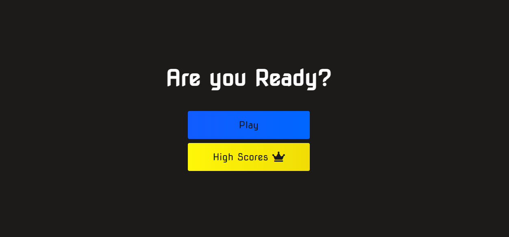
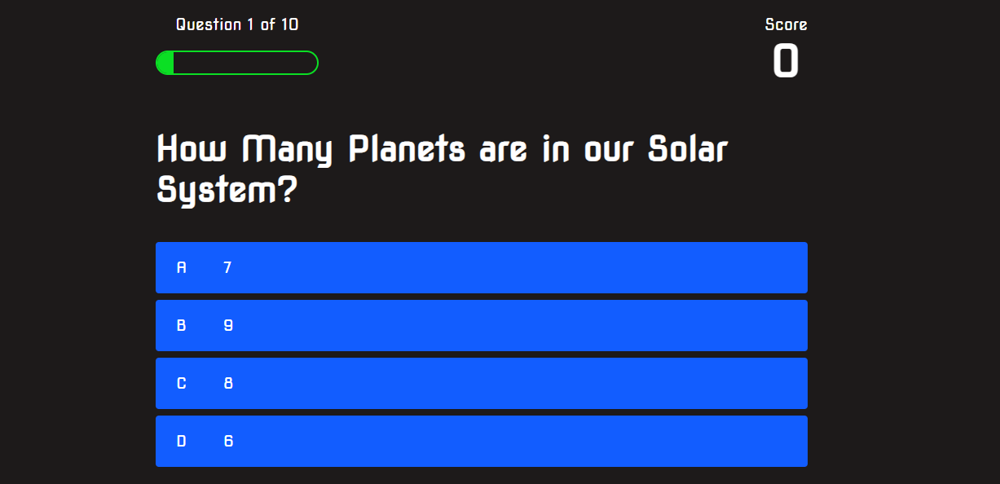
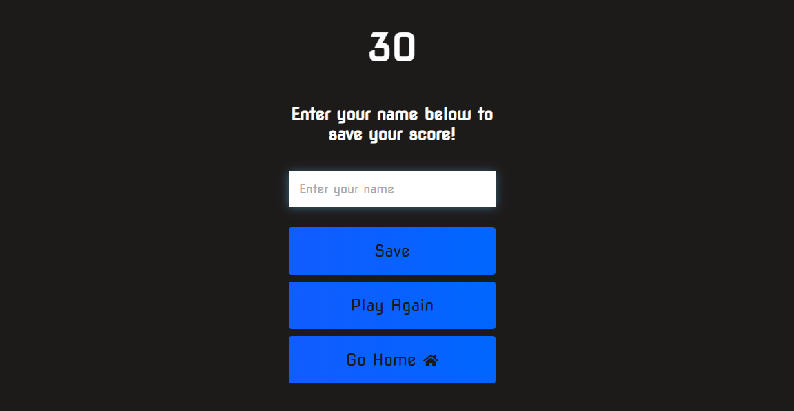
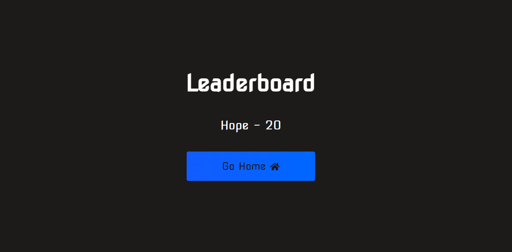

# Mini JS Quiz App

A simple and interactive quiz application built with JavaScript, allowing users to test their knowledge on various topics, save their scores, and view high scores.

## Features

- Interactive quiz interface with multiple-choice questions.
- Real-time score tracking.
- Progress bar indicating the quiz progress.
- Local storage integration to save user scores and high scores.
- Functionality to save user names along with their scores.

## How to Play

1. Open the quiz app in your browser.
2. Answer the multiple-choice questions as they appear.
3. View your score at the end of the quiz.
4. Save your score by entering your name.
5. Check the high scores to see the top scores.

## Installation

1. Clone the repository:
   ```sh
   git clone https://github.com/HopSoft-Tech/js-quiz-app.git
   ```
2. Open the `index.html` file in your preferred web browser.

## Code Overview

### JavaScript

- `app.js`: Main logic for the quiz functionality, including:
  - Loading and displaying questions.
  - Handling user answers.
  - Keeping track of the score and progress.
  - Saving and displaying high scores.

### HTML

- `index.html`: Structure of the quiz app, including elements for questions, choices, progress, and score display.

### CSS

- `styles.css`: Basic styling for the quiz app to enhance user experience.

## Local Storage

- Scores and user names are stored in the browser's local storage.
- High scores are displayed in a sorted list.

## Screenshots


_Start screen of the quiz app._


_Question screen with multiple choices._


_End screen displaying the final score and option to save the score._


_High scores list displaying top scores._

## Contributing

Contributions are welcome! Feel free to open an issue or submit a pull request.

## License

This project is licensed under the MIT License.
